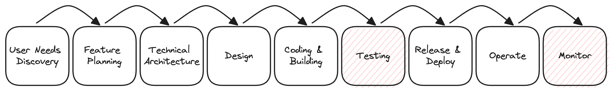
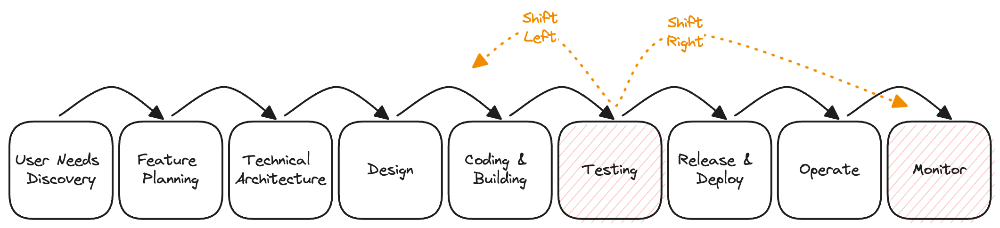

# Overall Testing Strategy
- Status: draft
- Author: @emmalu 
- Date: 11/02/2023

## Context
Testing is critical within the life-cycle of any application system. As such, this document is meant to guide all developers who write code for _any_ part of the GHGC project stack, in our implementation of testing practices.

## Summary
The intention is  to define a strategy that helps us ensure we are introducing clean, working code into the development pipeline, before eventually migrating it into production; as well as enabling us to seamlessly monitor the performance of our production code, in efforts to stay ahead of any faults that may arise out of real-world conditions.

## Strategy
### The Traditional Development Cycle

Traditionally, the software development life cycle (SDLC) has often placed *testing* and *monitoring* toward the *middle* and *end* of the software development workflows, respectively. While writing tests after feature development is possible, depending on feature complexity, this practice is prone to be less efficient as it can often be harder and more time-consuming to retrace the expected logic behind a new feature; and because it postpones the discovery of bugs, ultimately affecting product quality and user experience.

Following modern Agile & DevOps practices, we seek to improve on these norms by introducing testing and monitoring practices earlier in the development cycle, and by continuously testing and monitoring our code throughout the development process.

### Shifting Left
Considering the SDLC diagram above, we can improve our code-integration processes by opting to *Shift Left* - which is to say that when focusing on the development side of our software development practices, we should introduce testing as early in the process as possible. This includes the implementation of **local unit tests** alongside **static code analyses** (automated checks and manual reviews) for each part of our code-base in which we introduce new logic.

Under the umbrella of the Shift-Left approach, we should - when possible - work to adhere to a **test-driven development (TDD)**, where we:
1. intentionally express feature requirements as simple, single-task statements that we use to
2. translate into the equivalent unit test that we *then* use to
3. write our implementation code that we 
4. finally run against the previously written unit test in order to
5. ensure that we have the desired result data or outcome meeting the original requirement.

**Static code analyses** in the Continuous Integration pipeline should be implemented on top of other code-development methods like:
- using [Typing protocol](https://docs.python.org/3/library/typing.html) to *prevent* errors associated with expecting or sending incorrect or missing variables between functions and
- using code formatters like [Black](https://black.readthedocs.io/en/stable/) to standardize the style of our code, improving readibility for code reviews

**Unit tests** are meant to focus on **isolated features**, and should take the least amount of time to write and review. Writing unit tests while introducing new logic will encourage us to structure any new feature implementation into single-responsibility functions that we can then test deliberately.

**Integration tests** are meant to address **how features work together**, often as confirmation of how individual unit tests are meant to come together to result in a specific outcome. These tests should be written to confirm that the integration of new features does not break existing features.

To the benefit of the Shift Left approach, the simplicity of unit tests and automated nature of code analyses means they should require little, if any, maintenance. That said, one problem we should be mindful to avoid is that of testing any *framework functionality*. That is, when writing API endpoints within a Django app using the Django Rest Framework, we shouldn't need to confirm that a specific method does what the framework documentation specifies it does.

### Shifting Right
While we aim to consistently test our code in local and staging environments, the reality is that it is impossible to test against real-world conditions until our code is live, in the real-world production environment where there are both more data and more environment variables.

Considering the same SDLC diagram above, we should simultaneously employ *Shift Right* methods that allow us to better **monitor** the state of our production code. This can be done by introducing **End to End (E2E) tests** that successfully work through common or expected user workflows, while logging run-time server response times of those real network requests. While these tests can be more difficult and time consuming to write (and maintain), the metrics we log will then serve for data analysis - to help us identify baseline performance levels and inform decisions for establishing *error budgets*. Ultimately, performance data recorded from E2E tests will allow us to continuously track how our system responds over time, in relation to updates to *any* part of the system: data delivery, unpacking and integration, newly implemented or refactored application features, and infrastructure modifications.

##### Additional References:
- Test types: https://www.browserstack.com/guide/types-of-testing-developers-should-run
- Unit Tests in Python: https://www.digitalocean.com/community/tutorials/how-to-use-unittest-to-write-a-test-case-for-a-function-in-python
- E2E Testing: https://microsoft.github.io/code-with-engineering-playbook/automated-testing/e2e-testing/testing-comparison/
- Error budgets: https://www.atlassian.com/incident-management/kpis/error-budget